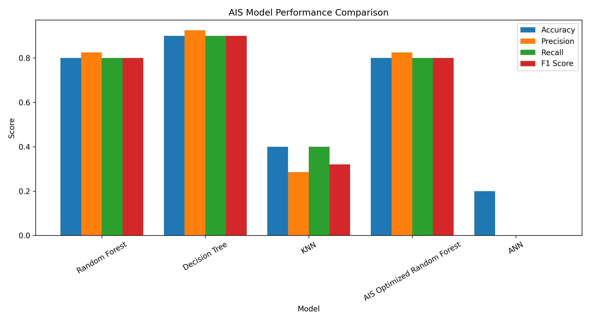

# Smart Regional Office Accessibility System using Artificial Immune System (AIS)

## Overview

The **Smart Regional Office Accessibility System** is an intelligent machine learning project that predicts the accessibility and service demand level of regional offices using office contact information and engineered accessibility features. The project applies the **Artificial Immune System (AIS)** optimization algorithm to optimize a Random Forest classifier for improved prediction accuracy.

The system analyzes regional office details such as office location, contact information, estimated business density, MSME coverage, population coverage, communication facilities, and accessibility indicators to classify each office into **Low**, **Medium**, or **High** service demand categories.

In addition to classification, the project predicts a continuous **Service Demand Score**, enabling better regional office planning and resource allocation.

---

# Objectives

- Predict regional office service demand.
- Optimize Random Forest using Artificial Immune System (AIS).
- Estimate accessibility score of each office.
- Generate complete analytics and visualizations.
- Save trained models for future deployment.
- Support intelligent regional office planning.

---

# Dataset

Dataset used:

```
contact_details_of_regional_branch_offices_of_tiic_31_12_2019.csv
```

Dataset Location

```
Smart Regional Office Accessibility/
```

---

# Machine Learning Workflow

```
Dataset
      │
      ▼
Data Cleaning
      │
      ▼
Feature Engineering
      │
      ▼
Encoding
      │
      ▼
Scaling
      │
      ▼
Train-Test Split
      │
      ▼
Base ML Models
      │
      ▼
AIS Optimization
      │
      ▼
Optimized Random Forest
      │
      ▼
Prediction
      │
      ▼
Visualization
      │
      ▼
Save Models
```

---

# Feature Engineering

The following intelligent features are generated automatically.

- District Extraction
- Office Type Detection
- Numeric Pincode
- Phone Count
- Email Availability
- Estimated Business Density
- Estimated MSME Count
- Estimated Distance Index
- Estimated Population Coverage
- Service Demand Score
- Demand Category

---

# Artificial Immune System (AIS)

AIS is a bio-inspired optimization algorithm based on the human immune system.

It performs:

- Antibody generation
- Clone selection
- Mutation
- Affinity evaluation
- Selection of best antibodies

The optimized antibody provides the best Random Forest hyperparameters.

Optimized Parameters include:

- Number of Trees
- Maximum Depth
- Minimum Samples Split
- Minimum Samples Leaf

---

# Machine Learning Models

The project compares multiple models.

- Random Forest
- Decision Tree
- K-Nearest Neighbor (KNN)
- AIS Optimized Random Forest
- Artificial Neural Network (ANN)

---

# Regression Model

A Random Forest Regressor predicts

- Service Demand Score

Regression Metrics

- MAE
- MSE
- RMSE
- R² Score

---

# Performance Metrics

Classification Metrics

- Accuracy
- Precision
- Recall
- F1 Score
- Confusion Matrix

Regression Metrics

- MAE
- MSE
- RMSE
- R² Score

---

# Project Structure

```
Smart Regional Office Accessibility/
│
├── contact_details_of_regional_branch_offices_of_tiic_31_12_2019.csv
│
├── ais_regional_office_accessibility_model.h5
├── ais_regional_office_accessibility_model.pkl
├── ais_regional_office_accessibility_config.yaml
├── ais_regional_office_accessibility_metadata.json
│
├── ais_result.csv
├── ais_prediction.csv
├── ais_processed_dataset.csv
├── ais_convergence_result.csv
├── ais_feature_importance.csv
├── ais_classification_report.csv
│
├── ais_accuracy_graph.png
├── ais_confusion_matrix_heatmap.png
├── ais_comparison_graph.png
├── ais_prediction_graph.png
├── ais_result_graph.png
├── ais_service_demand_score_graph.png
├── ais_convergence_graph.png
├── ais_ann_training_accuracy_graph.png
├── ais_ann_training_loss_graph.png
├── ais_feature_importance_graph.png
│
└── README.md
```

---

# Generated Outputs

## Models

- H5 Model
- PKL Model

---

## Configuration Files

- YAML Configuration
- JSON Metadata

---

## CSV Files

- Result CSV
- Prediction CSV
- Processed Dataset
- Feature Importance
- Classification Report
- AIS Convergence Data

---

## Graphs

- Accuracy Graph
- Comparison Graph
- Prediction Graph
- Result Graph
- Service Demand Score Graph
- Confusion Matrix Heatmap
- Feature Importance Graph
- ANN Accuracy Graph
- ANN Loss Graph
- AIS Convergence Graph

---

# Visualization

## Model Comparison



The comparison graph illustrates the performance of all machine learning models using:

- Accuracy
- Precision
- Recall
- F1 Score

It highlights the performance improvement achieved after optimizing the Random Forest classifier using the Artificial Immune System.

---

# Technologies Used

- Python
- Pandas
- NumPy
- Scikit-learn
- TensorFlow / Keras
- Matplotlib
- YAML
- Pickle
- JSON

---

# Installation

Install dependencies

```bash
pip install pandas
pip install numpy
pip install matplotlib
pip install scikit-learn
pip install tensorflow
pip install pyyaml
```

or

```bash
pip install pandas numpy matplotlib scikit-learn tensorflow pyyaml
```

---

# Running the Project

Execute

```bash
python main.py
```

or run the Jupyter Notebook cells sequentially.

---

# Results

The system automatically:

- Loads the dataset
- Cleans the data
- Performs feature engineering
- Trains multiple ML models
- Optimizes Random Forest using AIS
- Predicts demand category
- Predicts service demand score
- Evaluates classification performance
- Evaluates regression performance
- Generates visualizations
- Saves trained models
- Saves prediction results
- Saves graphs and reports

---

# Applications

The project can be used for:

- Smart Regional Office Planning
- Government Office Accessibility Analysis
- Branch Office Expansion Planning
- Resource Allocation
- Infrastructure Development
- Business Accessibility Analysis
- Public Service Optimization
- Decision Support Systems

---

# Future Enhancements

- GIS Integration
- Real-time Accessibility Prediction
- Traffic-based Accessibility Analysis
- Mobile Application
- Web Dashboard
- Deep Learning Models
- Explainable AI (XAI)
- Cloud Deployment
- IoT-enabled Accessibility Monitoring

---

# Author

**Sagnik Patra**

M.Tech (Computer Science & Engineering)

Machine Learning | Artificial Intelligence | Data Science | Bio-inspired Optimization

---

# License

This project is developed for educational and research purposes.
